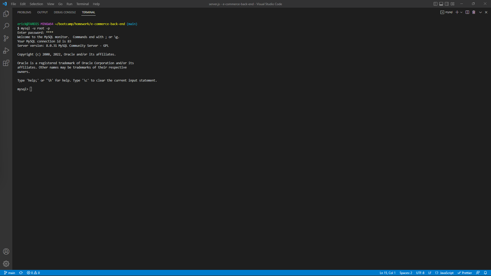
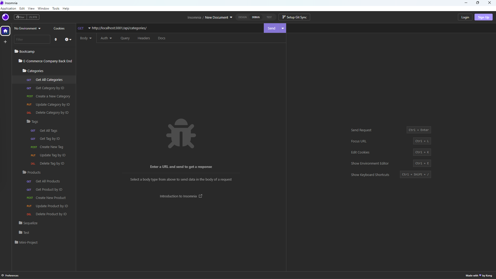

# E-Commerce Back End

## Description

Welcome to my E-Commerce Back End program!  This is a back end application for a mock e-commerce site that processes requests to manipulate a database in different ways.  I created this application to practice my abilities to create MODELS to define the stored data, and ROUTES that define the accepted types and natures of requests, actions, and responses.  Another valuable skill this project helped me improve is my further undertsanding of file structure to present a cleaner and more intuitive application.

Main Github Link: [Github Repo](https://github.com/ekirbs/e-commerce-back-end 'A back end application for an e-commerce site.')

## Table of Contents

- [Installation](#installation)
- [Usage](#usage)
- [Credits](#credits)
- [License](#license)

## Installation

* Uses Node Package Manager (npm).

* Uses the [MySQL2 package](https://www.npmjs.com/package/mysql2) to connect to a MySQL database.

* Uses the [Sequelize](https://www.npmjs.com/package/sequelize) package.

## Usage

Once all the required dependencies are installed, the database needs to be initialized.  open the  integrated terminal and access mysql [mysql -u root (-p)], and copy/paste the contents of the schema.sql file in the db folder into the terminal.  The company_db database will be created (careful: any existing db of that name will be deleted first).  Then quit out and type npm run seed to seed the database.  Finally, type npm start to start the program, then open in insomnia.

In insomnia, you are going to create GET, POST, PUT, and DELETE requests to interact with the database.  Any information sent in a request needs to have the correct URL path or it will return error messages.   To search by ID, the correct id number will need to be added to the end fo the route (Each item in a table has a unique id).

Watch the tutorial video below in the readme for assistance on the pathing and insomnia setup.  Enjoy!

CLICK ON THE IMAGES TO WATCH THE TUTORIAL VIDEOS!!!

 

## Credits

N/A

## License

N/A